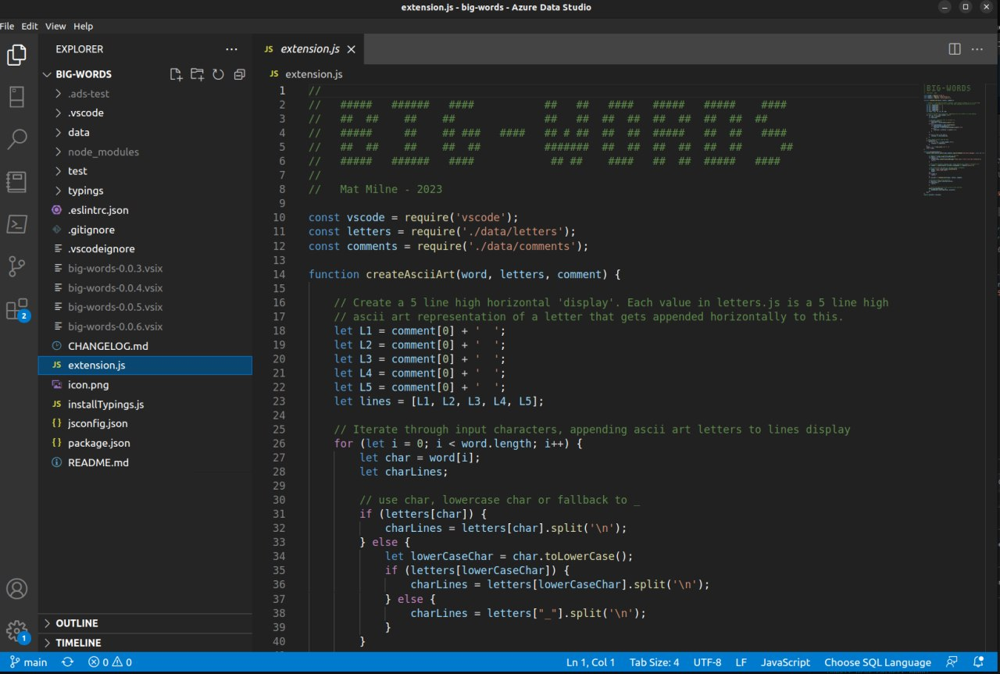

# [big-words](https://github.com/elmat0/big-words.git)

This wont make you Shakespeare, but it sure can help you read it!

* Open a script in vscode 
* Position the cursor 
* Open command pallet (<kbd>Ctrl</kbd>/<kbd>Cmd</kbd>+<kbd>Shift</kbd>+<kbd>P</kbd>)
* Type `Embiggen` and enter a text string

**Enjoy!**

